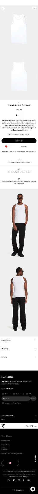
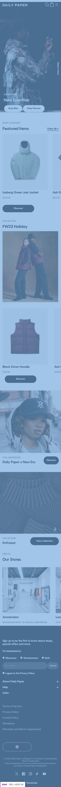
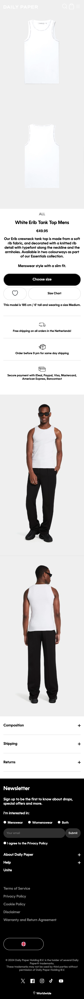
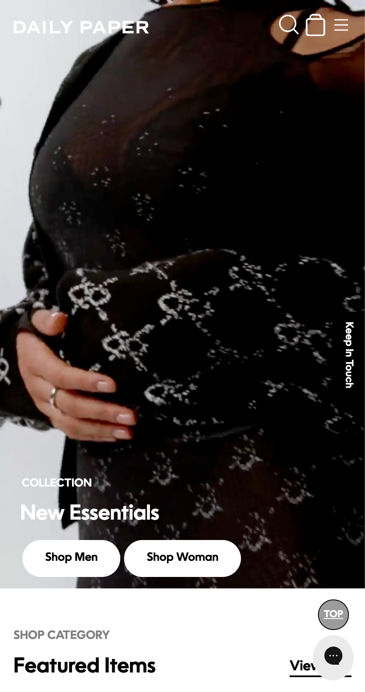

# Procesverslag
Markdown is een simpele manier om HTML te schrijven.  
Markdown cheat cheet: [Hulp bij het schrijven van Markdown](https://github.com/adam-p/markdown-here/wiki/Markdown-Cheatsheet).

Nb. De standaardstructuur en de spartaanse opmaak van de README.md zijn helemaal prima. Het gaat om de inhoud van je procesverslag. Besteedt de tijd voor pracht en praal aan je website.

Nb. Door *open* toe te voegen aan een *details* element kun je deze standaard open zetten. Fijn om dat steeds voor de relevante stuk(ken) te doen.

## Jij

  
uitwerken voor kick-off werkgroep

  ### Auteur:
 Nada Saidi

  #### Je startniveau:
 Blauw

  #### Je focus:
Surface plane
 

## Je website

  
uitwerken voor kick-off werkgroep

  ### Je opdracht:
  https://dailypaperclothing.com/

  #### Screenshot(s) van de eerste pagina (small screen): 
  Hompage Dailypaper  

 

  #### Screenshot(s) van de tweede pagina (small screen):
 Product pagina 
  
 

## Toegankelijkheidstest 1/2 (week 1)

  Vandaag heb ik de twee tests uitgevoerd: de screenreader-test en de WCAG-checklist.

**Screenreader:**

*Verwarring 1*

Bij het gebruik van de screenreader kwam ik erachter dat het onduidelijk is omdat afbeeldingen niet worden genoemd, alleen de HTTP-site wordt genoemd voor de volgende pagina. Je weet dus niet waar de knop zit en waar het over gaat. Dit kan verbeterd worden. Ook wordt het menubalk verteld als een lijst met 4 onderdelen in plaats van direct te beginnen met het benoemen van de menubalk. Dit kan voor verwarring zorgen.

### Bevindingen

Tijdens het testen kwam ik erachter dat een aantal zaken niet goed werkten of onduidelijk waren:

- Er is geen dark mode gebruikt.
- De knoppen zijn onduidelijk en niet goed leesbaar.
- Er is bijna geen feedback, en er is geen hover zichtbaar wanneer je eroverheen gaat.
- Wanneer een hover wordt gebruikt, valt dit niet op en is het heel onduidelijk.
- heeft geeen focus state

#### Screenreader

Tijdens de screenreader-test merkte ik op dat veel dingen Niet goed. werkte je merkt dat het menu wordt overgeslagen, tenzij je er op drukt, er wordt verteld dat het linkjes Zijn maar er wordt niet verteld waar dat linkje naartoe verwijst.

#### Muis en Toetsenbord

Zowel de muis als het toetsenbord werken prima. Je kunt alles openen met zowel het toetsenbord als de muis. Jammer genoeg ontbreekt er duidelijke hover-feedback, wat het proces soms onduidelijk maakt.

*Conclusie*

Voorgestelde oplossingen zijn onder andere het toevoegen van een dark mode, het toepassen van de hovers bij de knoppen voor betere klikbaarheid. 

## Breakdownschets (week 1)

  
uitwerken na afloop 3e werkgroep

  ### de hele pagina: 
 
 

  ### dynamisch deel (bijv menu): 
  

## Voortgang 1 (week 2)

  
uitwerken voor 1e voortgang

  ### Stand van zaken
  hier dit ging goed & dit was lastig (neem ook screenshots op van delen van je website en code)

  dit ging goed
  - aanmaken van een list item voor het menu
    

Dit vond ik moeilijk
- stylen van het hamburger menu
  

  ### Agenda voor meeting
  samen met je groepje opstellen

  |nada saidi    
                |
  -  hoe maak style?
  - Is mijn site goed genoeg voor de opdracht
  - Mijn website veranderd steeds, moet ik me ook daar aan houden?

  ### Verslag van meeting
  hier na afloop snel de uitkomsten van de meeting vastleggen

  - Dooe middel van een ul / li en dan laten animeren in Jv ( dit komt nog aanbod in de volgede lessen)
  - Het is een goede site maar ik moet wel 2 pagina's uitwerken.
  - Dat is geen probleem ik mag de eerste versie gebruiken.
  

## Voortgang 2 (week 3)

  
uitwerken voor 2e voortgang

  ### Stand van zaken
  hier dit ging goed & dit was lastig (neem ook screenshots op van delen van je website en code)

  ### Agenda voor meeting
  samen met je groepje opstellen

  wat is gelukt?
- De items voor een menu is gelukt om dit in een ul /li en a te zetten zodat het klikbaar is.
- Mijn basis van mijn html is gelukt op de footer na

de vragen die ik had :

- mag de footer in een section.
- Hoe kan ik de code voor een forum krijgen en aanpassen?

  ### Verslag van meeting
  - De footer mag in een section
  - Dit kan je opzoeken op internet daar vind je de juiste html/css code ervoor dit mag ik kopieren en plakken

- ...

## Toegankelijkheidstest 2/2 (week 4)

 ### Bevindingen

Tijdens het testen van de website heb ik enkele positieve aspecten opgemerkt:

- De website maakt gebruik van een heldere en duidelijke weergave, zonder dark mode.
- De knoppen op de website zijn goed zichtbaar en leesbaar, wat bijdraagt aan een goede gebruikerservaring.
- Er is voldoende feedback aanwezig op de website, waardoor gebruikers duidelijk kunnen begrijpen hoe ze met de interface moeten interacteren.
- Bij het gebruik van de muis en het toetsenbord verliep alles soepel, waardoor alle functies op een toegankelijke manier te activeren waren.

Screenreader

Tijdens de screenreader-test verliep het proces niet echt  positief. De screenreader benoemde niet de verschillende elementen op de website correct, waaronder het menu dat niet op een gestructureerde wijze werd voorgelezen. Ook de linkjes worden niet op de juiste manier benoemd

Conclusie

De website presteert beter dan eerst maar is nog steeds ruimte voor verbetering in mijn site, mijn html klopt nog niet helemaal, en is niet correct nog, dit moet ik oppakken ook moet ik die linkjes ergens naar toe leiden anders klopt het niet, ook zal ik nog een darmmode toevoegen en hover states voor de knoppen

## Voortgang 3 (week 4)

  
uitwerken voor 3e voortgang

  ### Stand van zaken
  hier dit ging goed & dit was lastig (neem ook screenshots op van delen van je website en code)

  ### Agenda voor meeting
  samen met je groepje opstellen

- Laatste 2 knoppen niet kleiner
-  Ander fonts om dunner te maken
- Oceanwide fonts kan ik niet vinden
- Future item mag je section gebruiken
- Logo plaatje
- Scrolll bar weg doen

  ### Verslag van meeting
  hier na afloop snel de uitkomsten van de meeting vastleggen

  -  de Knoppen hoeven niet kleiner
  -  fonts gelukt door hun van docent
  -  mag in een section
  - foote Scroll bar moet blijven

## Eindgesprek (week 5)

  
uitwerken voor eindgesprek

  ### Je uitkomst - karakteristiek screenshots:

  ### Dit ging goed/Heb ik geleerd: 
Ik heb geleerd hoe ik een carrosal kan toevoegen en stylen, het is gelukt om een video erin te zetten .

  ### Dit was lastig/Is niet gelukt:
 Er waren 2 soorten fonts de dikke versie en wat dunnere versie, die dunne versie kon ik nergens vinden en moest je er voor betalen dus maar 1 deel van het vond kon ik krijgen en toepassen. Ik vond het een enorme uitdaging dit vak maar na bloed zweet en tranen (letterlijk) ben ik enorm trots op de uitkomst!

## Bronnenlijst

  
continu bijhouden terwijl je werkt

  Nb. Wees specifiek ('css-tricks' als bron is bijv. niet specifiek genoeg). 
  Nb. ChatGpT en andere AI horen er ook bij.
  Nb. Vermeld de bronnen ook in je code.

 <!-- 
    Bronnne:
    1. https://developer.mozilla.org/en-US/
    2. https://codepen.io/nadasaidi2002/pen/WNPRQYX?editors=1100 (hamburgermenu)
    3. https://codepen.io/Nadasaidi2002/pen/gOEwLJv (carrousels)
    4. Martin (docent)
    5. Studentenassistente 
    6. Chat GPT ( Hoe zorg ik ervoor dat iets klibaar is op html css?)  
       6.1 hoe voeg ik een class toe
       6.2 hoe stijl ik een carrosel
       6.3 hoe zorg ik ervoor dat een plaatje achter de tekst komt
    7. CMD-genoten
    8. https://www.youtube.com/watch?v=RIDA6elhmBU&ab_channel=KevinPowell 
    9. https://www.youtube.com/watch?v=nANWDdsCG5U&ab_channel=SoundEffectsandGreenScreen
 -->

